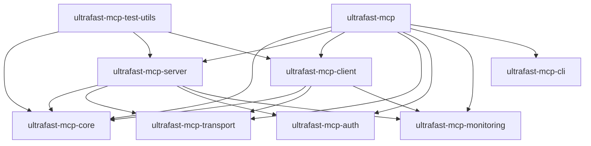

# UltraFast MCP Development Guide

This guide provides comprehensive information for developers contributing to or building with the UltraFast MCP framework.

## Table of Contents

1. [Getting Started](#getting-started)
2. [Project Structure](#project-structure)
3. [Development Setup](#development-setup)
4. [Building and Testing](#building-and-testing)
5. [Architecture Overview](#architecture-overview)
6. [Contributing Guidelines](#contributing-guidelines)
7. [Code Style and Standards](#code-style-and-standards)
8. [Testing Strategy](#testing-strategy)
9. [Performance Considerations](#performance-considerations)
10. [Debugging and Troubleshooting](#debugging-and-troubleshooting)

## Getting Started

### Prerequisites

- **Rust**: 1.70 or later
- **Cargo**: Latest stable version
- **Git**: For version control
- **Node.js**: 18+ (for MCP Inspector testing)

### Quick Setup

```bash
# Clone the repository
git clone https://github.com/your-repo/ultrafast-mcp
cd ultrafast-mcp

# Install dependencies
cargo build

# Run tests
cargo test

# Run examples
cargo run --example basic-echo-server
```

## Project Structure

```
ultrafast-mcp/
├── Cargo.toml                 # Workspace configuration
├── crates/                    # Individual crates
│   ├── ultrafast-mcp-core/    # Core protocol implementation
│   ├── ultrafast-mcp-server/  # Server implementation
│   ├── ultrafast-mcp-client/  # Client implementation
│   ├── ultrafast-mcp-transport/ # Transport layer
│   ├── ultrafast-mcp-auth/    # Authentication
│   ├── ultrafast-mcp-monitoring/ # Observability
│   ├── ultrafast-mcp-cli/     # Command-line tools
│   ├── ultrafast-mcp-test-utils/ # Testing utilities
│   └── ultrafast-mcp/         # Main crate (re-exports)
├── examples/                  # Example implementations
│   ├── 01-basic-echo/         # Basic echo server
│   ├── 02-file-operations/    # File operations
│   ├── 03-http-server/        # HTTP server with auth
│   ├── 04-advanced-features/  # Advanced features
│   └── 05-lifecycle-compliance/ # Lifecycle management
├── tests/                     # Integration tests
├── benches/                   # Performance benchmarks
├── docs/                      # Documentation
└── scripts/                   # Build and release scripts
```

### Crate Dependencies



## Development Setup

### Environment Setup

1. **Install Rust Toolchain**:
   ```bash
   curl --proto '=https' --tlsv1.2 -sSf https://sh.rustup.rs | sh
   source ~/.cargo/env
   rustup default stable
   ```

2. **Install Development Tools**:
   ```bash
   # Install useful cargo extensions
   cargo install cargo-watch
   cargo install cargo-audit
   cargo install cargo-tarpaulin
   cargo install cargo-deny
   
   # Install MCP Inspector for testing
   npm install -g @modelcontextprotocol/inspector
   ```

3. **IDE Setup**:
   - **VS Code**: Install Rust extension
   - **IntelliJ IDEA**: Install Rust plugin
   - **Vim/Neovim**: Install rust-analyzer

### Workspace Configuration

The project uses Cargo workspaces for efficient dependency management:

```toml
[workspace]
members = [
    "crates/*",
    "examples/*",
    "tests/*",
]

[workspace.package]
version = "20250618.1.0-rc.2"
edition = "2021"
authors = ["UltraFast MCP Team"]
license = "MIT OR Apache-2.0"
repository = "https://github.com/your-repo/ultrafast-mcp"
keywords = ["mcp", "model-context-protocol", "ai", "llm"]
categories = ["api-bindings", "asynchronous", "network-programming"]

[workspace.dependencies]
tokio = { version = "1.0", features = ["full"] }
serde = { version = "1.0", features = ["derive"] }
serde_json = "1.0"
thiserror = "1.0"
anyhow = "1.0"
tracing = "0.1"
tracing-subscriber = "0.3"
async-trait = "0.1"
```

## Building and Testing

### Build Commands

```bash
# Build all crates
cargo build

# Build specific crate
cargo build -p ultrafast-mcp-server

# Build with specific features
cargo build --features "http,oauth,monitoring"

# Build in release mode
cargo build --release

# Build examples
cargo build --examples
```

### Testing

```bash
# Run all tests
cargo test

# Run tests for specific crate
cargo test -p ultrafast-mcp-core

# Run integration tests
cargo test --test integration_tests

# Run tests with output
cargo test -- --nocapture

# Run tests with specific pattern
cargo test test_tool_execution

# Run benchmarks
cargo bench
```

### Code Quality Checks

```bash
# Format code
cargo fmt

# Run clippy
cargo clippy

# Run clippy with all warnings
cargo clippy -- -W clippy::all

# Check for security vulnerabilities
cargo audit

# Check dependencies
cargo deny check

# Generate documentation
cargo doc --no-deps --open
```

## Architecture Overview

### Core Design Principles

1. **Modularity**: Each crate has a single responsibility
2. **Type Safety**: Compile-time guarantees for protocol compliance
3. **Async-First**: Built on `tokio` for high-performance async operations
4. **Error Handling**: Comprehensive error types with context
5. **Extensibility**: Trait-based interfaces for easy extension

### Protocol Implementation

The framework implements the MCP 2025-06-18 specification with the following layers:

```
┌─────────────────────────────────────────────────────────────┐
│                    Application Layer                        │
├─────────────────────────────────────────────────────────────┤
│                    Handler Layer                            │
│  ┌─────────────┐ ┌─────────────┐ ┌─────────────┐          │
│  │ ToolHandler │ │ResourceHndlr│ │PromptHandler│          │
│  └─────────────┘ └─────────────┘ └─────────────┘          │
├─────────────────────────────────────────────────────────────┤
│                    Protocol Layer                           │
│  ┌─────────────┐ ┌─────────────┐ ┌─────────────┐          │
│  │ JSON-RPC    │ │ Lifecycle   │ │ Validation  │          │
│  └─────────────┘ └─────────────┘ └─────────────┘          │
├─────────────────────────────────────────────────────────────┤
│                    Transport Layer                          │
│  ┌─────────────┐ ┌─────────────┐ ┌─────────────┐          │
│  │ STDIO       │ │ HTTP        │ │ Custom      │          │
│  └─────────────┘ └─────────────┘ └─────────────┘          │
└─────────────────────────────────────────────────────────────┘
```

### Key Components

#### Core Crate (`ultrafast-mcp-core`)

- **Types**: All MCP protocol types with serde support
- **Protocol**: JSON-RPC implementation and lifecycle management
- **Schema**: JSON Schema generation and validation
- **Error**: Comprehensive error types and handling
- **Utils**: Common utilities for pagination, progress, etc.

#### Server Crate (`ultrafast-mcp-server`)

- **UltraFastServer**: Main server implementation
- **Handlers**: Trait definitions for all handler types
- **Context**: Request context and utilities
- **Lifecycle**: Server lifecycle management

#### Client Crate (`ultrafast-mcp-client`)

- **UltraFastClient**: Main client implementation
- **State Management**: Client state and connection management
- **Operations**: All MCP operations (tools, resources, etc.)
- **Recovery**: Connection recovery and retry logic

#### Transport Crate (`ultrafast-mcp-transport`)

- **Transport Trait**: Abstract transport interface
- **STDIO**: Standard input/output transport
- **HTTP**: Streamable HTTP transport
- **Recovery**: Connection recovery mechanisms

## Contributing Guidelines

### Development Workflow

1. **Fork and Clone**: Fork the repository and clone your fork
2. **Create Branch**: Create a feature branch from `main`
3. **Make Changes**: Implement your changes with tests
4. **Test**: Ensure all tests pass
5. **Document**: Update documentation as needed
6. **Submit PR**: Create a pull request with clear description

### Commit Message Format

Use conventional commit format:

```
type(scope): description

[optional body]

[optional footer]
```

Types:
- `feat`: New feature
- `fix`: Bug fix
- `docs`: Documentation changes
- `style`: Code style changes
- `refactor`: Code refactoring
- `test`: Test changes
- `chore`: Build/tooling changes

Examples:
```
feat(server): add support for custom transport handlers
fix(client): resolve connection timeout issues
docs(core): update API documentation
test(integration): add comprehensive integration tests
```

### Pull Request Guidelines

1. **Title**: Clear, descriptive title
2. **Description**: Detailed description of changes
3. **Tests**: Include tests for new functionality
4. **Documentation**: Update relevant documentation
5. **Breaking Changes**: Clearly mark breaking changes
6. **Performance**: Consider performance implications

### Code Review Process

1. **Automated Checks**: All PRs must pass CI checks
2. **Review**: At least one maintainer must approve
3. **Testing**: Changes must be tested thoroughly
4. **Documentation**: Documentation must be updated
5. **Merge**: Squash and merge to maintain clean history

## Code Style and Standards

### Rust Style Guide

Follow the [Rust Style Guide](https://doc.rust-lang.org/1.0.0/style/style/naming/README.html):

```rust
// Use snake_case for variables and functions
let user_name = "alice";
fn calculate_total() -> u32 { /* ... */ }

// Use SCREAMING_SNAKE_CASE for constants
const MAX_RETRY_ATTEMPTS: u32 = 5;

// Use PascalCase for types
struct UserProfile { /* ... */ }
enum ConnectionState { /* ... */ }

// Use camelCase for enum variants
enum Error {
    ConnectionFailed,
    InvalidInput,
}
```

### Documentation Standards

```rust
/// Calculate the sum of two numbers.
///
/// # Arguments
///
/// * `a` - The first number
/// * `b` - The second number
///
/// # Returns
///
/// The sum of `a` and `b`
///
/// # Examples
///
/// ```
/// use my_crate::add;
///
/// assert_eq!(add(2, 3), 5);
/// ```
pub fn add(a: i32, b: i32) -> i32 {
    a + b
}
```

### Error Handling

Use consistent error handling patterns:

```rust
use thiserror::Error;

#[derive(Error, Debug)]
pub enum MyError {
    #[error("Invalid input: {message}")]
    InvalidInput { message: String },
    
    #[error("Network error: {0}")]
    Network(#[from] std::io::Error),
    
    #[error("Serialization error: {0}")]
    Serialization(#[from] serde_json::Error),
}

// Use ? operator for error propagation
pub fn process_data(data: &str) -> Result<String, MyError> {
    let parsed = serde_json::from_str(data)?;
    Ok(parsed.to_string())
}
```

### Async/Await Patterns

```rust
use async_trait::async_trait;

#[async_trait]
pub trait MyHandler: Send + Sync {
    async fn handle_request(&self, request: Request) -> Result<Response, Error>;
}

// Use tokio::spawn for concurrent operations
pub async fn process_concurrent(items: Vec<Item>) -> Vec<Result> {
    let handles: Vec<_> = items
        .into_iter()
        .map(|item| tokio::spawn(process_item(item)))
        .collect();
    
    let results = futures::future::join_all(handles).await;
    results.into_iter().map(|r| r.unwrap()).collect()
}
```

## Testing Strategy

### Unit Tests

Place unit tests in the same file as the code:

```rust
#[cfg(test)]
mod tests {
    use super::*;

    #[test]
    fn test_add_function() {
        assert_eq!(add(2, 3), 5);
        assert_eq!(add(-1, 1), 0);
    }

    #[tokio::test]
    async fn test_async_function() {
        let result = async_function().await;
        assert!(result.is_ok());
    }
}
```

### Integration Tests

Create integration tests in `tests/` directory:

```rust
// tests/integration_tests.rs
use ultrafast_mcp::prelude::*;

#[tokio::test]
async fn test_server_client_communication() {
    // Test setup
    let server = create_test_server().await;
    let client = create_test_client().await;
    
    // Test execution
    let result = client.call_tool(ToolCall {
        name: "test".to_string(),
        arguments: None,
    }).await;
    
    // Assertions
    assert!(result.is_ok());
}
```

### Property-Based Testing

Use `proptest` for property-based testing:

```rust
use proptest::prelude::*;

proptest! {
    #[test]
    fn test_serialization_roundtrip(data: String) {
        let serialized = serde_json::to_string(&data).unwrap();
        let deserialized: String = serde_json::from_str(&serialized).unwrap();
        assert_eq!(data, deserialized);
    }
}
```

### Performance Testing

Use benchmarks for performance-critical code:

```rust
use criterion::{black_box, criterion_group, criterion_main, Criterion};

fn benchmark_serialization(c: &mut Criterion) {
    let data = create_test_data();
    
    c.bench_function("serialize", |b| {
        b.iter(|| serde_json::to_string(black_box(&data)))
    });
}

criterion_group!(benches, benchmark_serialization);
criterion_main!(benches);
```

## Performance Considerations

### Memory Management

1. **Avoid Allocations**: Reuse buffers and avoid unnecessary allocations
2. **Use References**: Prefer references over owned data when possible
3. **Streaming**: Use streaming for large data sets
4. **Pooling**: Use connection and object pooling

```rust
// Good: Reuse buffer
let mut buffer = Vec::with_capacity(1024);
for item in items {
    buffer.clear();
    buffer.extend_from_slice(&item);
    process_buffer(&buffer);
}

// Good: Use references
fn process_data(data: &[u8]) -> Result<(), Error> {
    // Process without copying
}
```

### Async Performance

1. **Avoid Blocking**: Don't block the async runtime
2. **Use Spawn Blocking**: Move CPU-intensive work to thread pool
3. **Batch Operations**: Batch multiple operations when possible
4. **Connection Pooling**: Reuse connections

```rust
// Good: Use spawn_blocking for CPU-intensive work
let result = tokio::task::spawn_blocking(move || {
    cpu_intensive_operation(data)
}).await?;

// Good: Batch operations
let results = futures::future::join_all(
    operations.into_iter().map(|op| process_operation(op))
).await;
```

### Network Performance

1. **Connection Reuse**: Reuse HTTP connections
2. **Compression**: Enable compression for large payloads
3. **Timeouts**: Set appropriate timeouts
4. **Retry Logic**: Implement exponential backoff

```rust
// Good: Configure HTTP client with connection pooling
let client = reqwest::Client::builder()
    .pool_max_idle_per_host(10)
    .timeout(Duration::from_secs(30))
    .build()?;
```

## Debugging and Troubleshooting

### Logging

Use structured logging with `tracing`:

```rust
use tracing::{info, warn, error, debug};

// Initialize logging
tracing_subscriber::fmt()
    .with_env_filter("info,ultrafast_mcp=debug")
    .with_target(false)
    .with_thread_ids(true)
    .init();

// Use structured logging
info!(user_id = %user.id, action = "login", "User logged in");
warn!(error = %e, "Failed to connect to database");
error!(error = %e, "Critical error occurred");
```

### Debugging Tools

1. **Rust Analyzer**: IDE integration for debugging
2. **GDB/LLDB**: Command-line debugging
3. **Cargo Watch**: Auto-reload during development
4. **MCP Inspector**: Protocol-level debugging

### Common Issues

#### Connection Issues

```rust
// Check connection state
let state = client.get_state().await;
println!("Client state: {:?}", state);

// Check server capabilities
let capabilities = client.get_server_capabilities().await;
println!("Server capabilities: {:?}", capabilities);
```

#### Serialization Issues

```rust
// Debug serialization
let json = serde_json::to_string_pretty(&data)?;
println!("Serialized data: {}", json);

// Validate against schema
let is_valid = validate_against_schema(&data, &schema)?;
if !is_valid {
    println!("Schema validation failed");
}
```

#### Performance Issues

```rust
// Profile with tracing
let span = tracing::info_span!("expensive_operation");
let _enter = span.enter();

// Measure execution time
let start = std::time::Instant::now();
expensive_operation().await?;
let duration = start.elapsed();
tracing::info!(duration = ?duration, "Operation completed");
```

### Testing with MCP Inspector

1. **Build Server**: `cargo build --release`
2. **Start Inspector**: `mcp-inspector`
3. **Connect**: Use the web interface to connect to your server
4. **Test**: Use the inspector to test all MCP methods

### Profiling

Use `cargo flamegraph` for performance profiling:

```bash
# Install flamegraph
cargo install flamegraph

# Generate flamegraph
cargo flamegraph --example basic-echo-server
```

## Release Process

### Version Management

1. **Semantic Versioning**: Follow semver (MAJOR.MINOR.PATCH)
2. **Changelog**: Update CHANGELOG.md with all changes
3. **Tagging**: Create git tags for releases
4. **Crates.io**: Publish to crates.io

### Release Checklist

- [ ] All tests pass
- [ ] Documentation is updated
- [ ] Changelog is updated
- [ ] Version is bumped
- [ ] Git tag is created
- [ ] Crates are published
- [ ] Release notes are published

### Publishing Order

Publish crates in dependency order:

1. `ultrafast-mcp-core`
2. `ultrafast-mcp-transport`
3. `ultrafast-mcp-auth`
4. `ultrafast-mcp-monitoring`
5. `ultrafast-mcp-test-utils`
6. `ultrafast-mcp-server`
7. `ultrafast-mcp-client`
8. `ultrafast-mcp-cli`
9. `ultrafast-mcp`

## Support and Resources

### Documentation

- [API Documentation](https://docs.rs/ultrafast-mcp)
- [MCP Specification](https://modelcontextprotocol.io)
- [Rust Book](https://doc.rust-lang.org/book/)
- [Tokio Documentation](https://tokio.rs)

### Community

- [GitHub Issues](https://github.com/your-repo/ultrafast-mcp/issues)
- [GitHub Discussions](https://github.com/your-repo/ultrafast-mcp/discussions)
- [MCP Community](https://modelcontextprotocol.io/community)

### Tools

- [MCP Inspector](https://github.com/modelcontextprotocol/inspector)
- [Rust Analyzer](https://rust-analyzer.github.io)
- [Cargo Watch](https://github.com/watchexec/cargo-watch)

---

This development guide provides comprehensive information for contributing to and building with UltraFast MCP. For additional questions or clarifications, please open an issue or discussion on GitHub. 